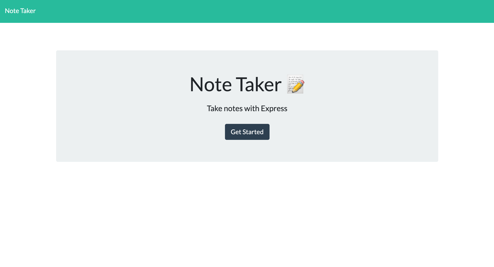
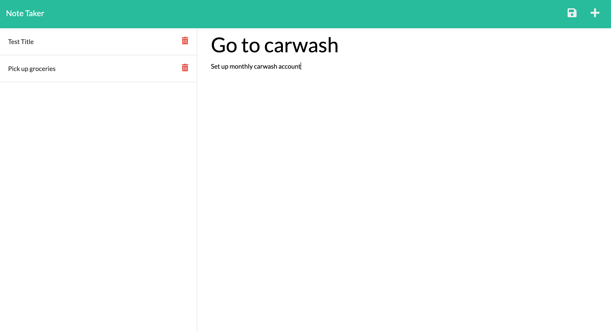

# Never Miss A Note
### License:
[](https://opensource.org/licenses/MIT) 
### License Description:
[Click here for the most current description of this license](https://opensource.org/licenses/MIT)
### Link to deployed project:
Link for the deployed project is unavailable
## Table of Contents: 
* [Description](#description)
* [Installation](#installation)
* [Usage Instructions](#usage-instructions)
* [License](#license)
* [Questions](#questions)
* [Screenshots](#screenshot)
### Description of the project:
This app allows a user to write and save notes. Begin by selecting the new note and then typing a title then a description below. Once finished the user can click the floppy disk to save the note. Saved notes will automatically display in the left sidebar. If the user clicks the trashcan next to the note, the note will delete. If the user clicks the plus sign in the top right, the user will be presented with the new note template.
### Installation:
In order to install the necessary dependencies, open the console and run the following:
```npm i, npm i express```
### Usage Instructions:
Copy the code SSH keys from this repo and then clone it in terminal. Open the file in VS code. After installing the dependencies, go into the server.js folder and run the following ```node server.js```
### Questions:
If you have any questions contact me on [GitHub](https://github.com/AmberZimmerman) 
### Screenshot:
 

